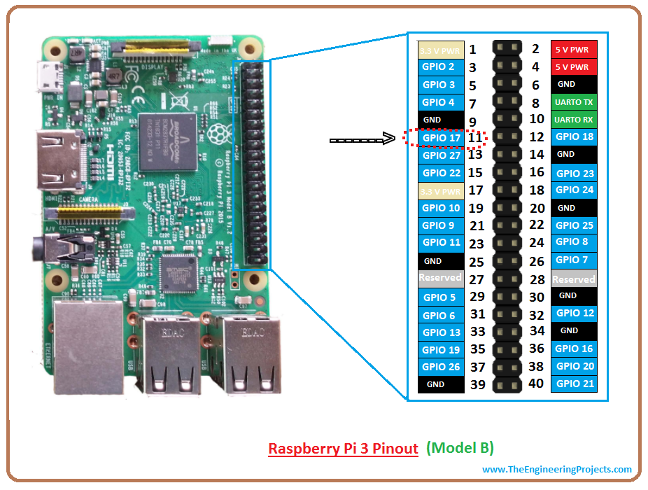
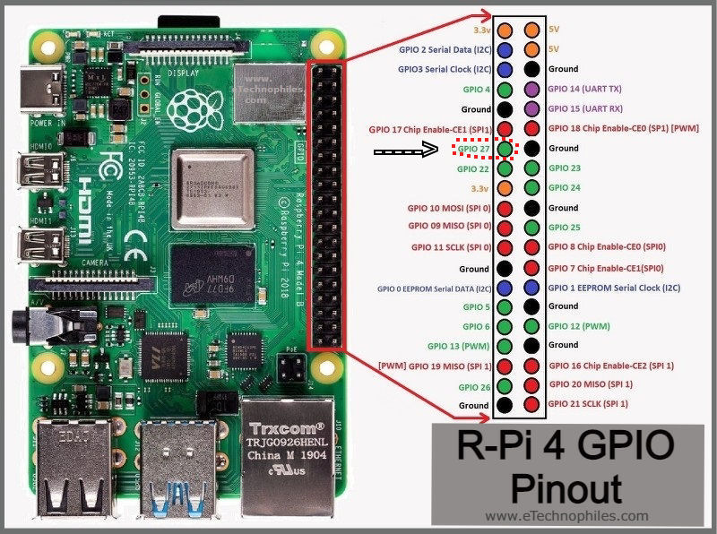

# Pir-Sensor
NOW WORKS WITH PI4 (HDMI0) AND RPI3 [PLEASE READ THIS ENTIRE README!]
 
# 1st in a terminal window:
    sudo apt-get install wiringpi
    
___________________________________________________________________________________

Download and put all files in your root directory on your Raspberry Pi

# chmod all files:
   From a terminal window in your root directoy (Where the files are):
   
    sudo chmod +x pir.py
    sudo chmod +x monitor_off.sh
    sudo chmod +x monitor_on.sh

Editing pir.py

# GO TO THIS LINE   
    For RIP3 from PIR DATA PIN: PIR_PIN = 17       - Pin 11 on the RPI3
    For RPI4 from PIR DATA PIN: PIR_PIN = 27       - Pin 13 on the RPI4
   
   IF you want to change PIR_PIN for some reason:
   
   You will need to change this to the pin you're using on the pi for your sensor, to make it easy I would just use it the way it's setup.
   Remember that what the pi reads and what the actual pin number is not the same.
   
# FROM PIR SENSOR
    VCC to 5V on either board
    GROUND TO GROUND on either board
    No matter which 5v or Ground you use!  
   
  
  
   
   ___________________________________________________________________________________
   
   Last step:
   
   In a terminal window from your root directory enter:
   
   sudo crontab -e
   
   On the last line enter:
   
   @reboot python /home/pi/pir.py &
   
   Hit CRTL-O to save
   then exit
   
   Reboot your pi
   
   _______________________________________________________________
   
   OTHER ADJUSTMENTS:
   
   In the pir.py go to the line:
   
   SHUTOFF_DELAY = 20  # seconds
   
   That's how long if NO motion is dectected the pi will shut off the screen.  Change it to your desired number of seconds.

   Other things:
   If you don't want to put this in  your home directory then you can clone to the directory of your choice BUT remember to adjust your path in crontab... or it won't work!
